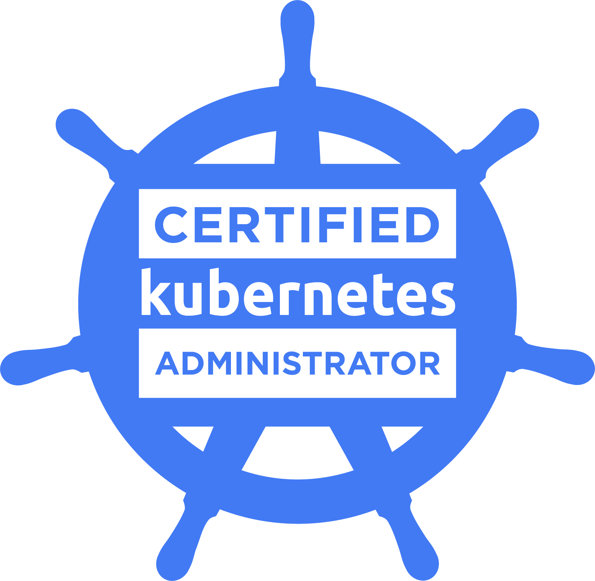

### About Me

I am a seasoned DevOps Engineer and Azure Architect with three years of industry experience, specializing in cloud infrastructure management, automation and Kubernetes orchestration. My passion lies in streamlining development processes, optimizing system performance and ensuring robust deployment pipelines for efficient software delivery.

### Certifications

     

### Expertise

- **DevOps:** Skilled in implementing DevOps practices and methodologies to enhance collaboration between development and operations teams, automate software delivery processes and accelerate time-to-market.

- **Cloud Computing:** Proficient in designing, deploying and managing cloud infrastructure on Microsoft Azure, leveraging a wide range of services to meet business requirements effectively.

- **Containerization:** Experienced in containerization technologies such as Docker and Kubernetes, proficient in container orchestration, networking and management for scalable and resilient microservices architectures.

- **Infrastructure as Code (IaC):** Experienced in using tools like Terraform and Azure Resource Manager (ARM) templates to provision and manage infrastructure resources in a declarative and version-controlled manner.

### Projects

- **Automated CI/CD Pipeline:** Designed and implemented a robust CI/CD pipeline using Jenkins or GitHub Actions for automating build, test and deployment processes, ensuring seamless software delivery.

- **Kubernetes Cluster Setup:** Orchestrated the deployment of Kubernetes clusters on cloud platforms (Azure Kubernetes Service) or on-premises environments, ensuring high availability, scalability and security.

- **Infrastructure Automation:** Developed automation scripts and workflows using Ansible and PowerShell to automate provisioning, configuration and management of cloud infrastructure and application environments.

### Get in Touch

- **LinkedIn:** [Andrea Moscato](https://www.linkedin.com/in/andrea-moscato)
- **Email:** [andreamos2909@gmail.com](mailto:andreamos2909@gmail.com)

Feel free to reach out to discuss collaboration opportunities, share insights, or explore potential projects. I'm always open to connecting with like-minded professionals in the industry.

---

This README serves as a snapshot of my professional journey, showcasing my skills, certifications and projects. Stay tuned for updates and new additions as I continue to evolve and contribute to the ever-changing landscape of DevOps and cloud computing. Thank you for visiting!
